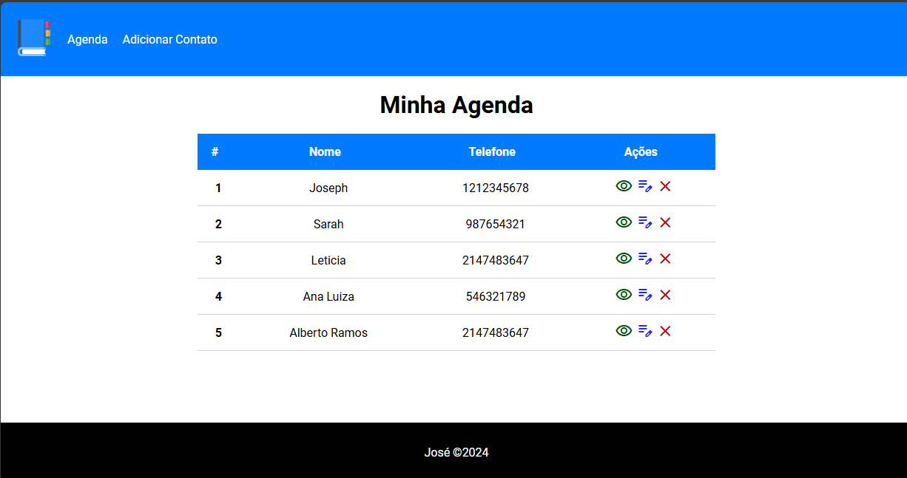
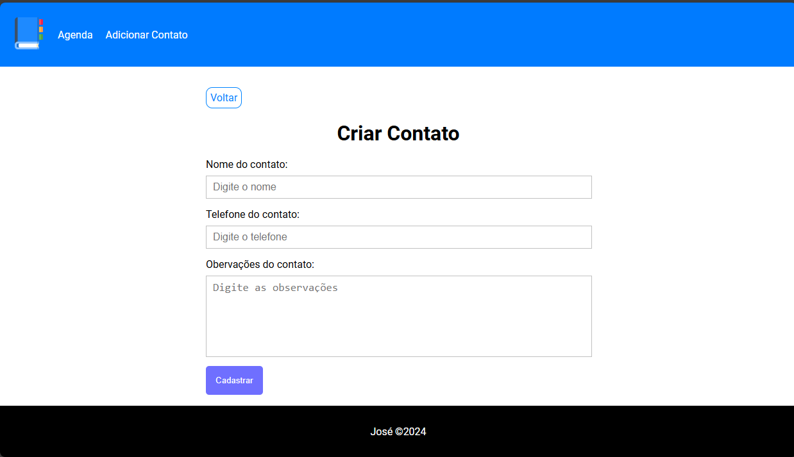
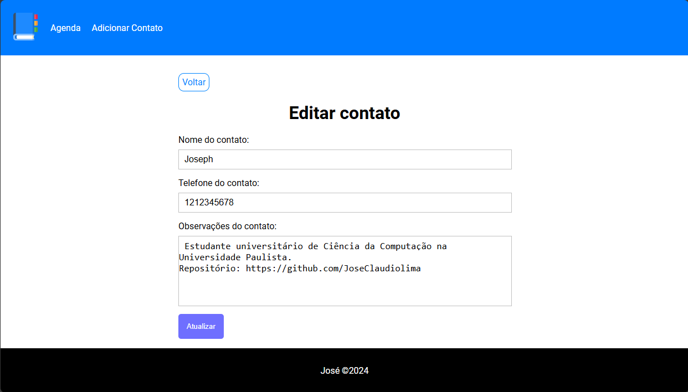

# Projeto Agenda SQL Backend

"Agendas" é um projeto desenvolvido em PHP e SQL, com HTML/CSS para a interface. Tem por objetivo o desenvolvimento de uma agenda web em que o usuário pode cadastrar os seus contatos, colocando informações de nome, telefone e observações. Além de fácil manipulação de dados, como a inserção, edição e remoção dos dados. Portanto está de acordo com as normas CRUD (Create, Read, Update e Delete).

## Prints do Projeto

### Área do Cliente


### Visão da Empresa


### Visão da Empresa



## Funcionalidades

### Inserção
- Criação de um novo contato, contendo os campos:
- Nome
- Telefone
- Observações

### Edição
- Permite a edição dos dados já cadastrados em seus devidos campos.

### Remoção
- Permite a remoção de contatos já cadastrados em seus devidos campos.

## Tecnologias Utilizadas
- PHP (PDO)
- SQL e MYSQL
- HTML/CSS

## Instalação

1. Clone o repositório para o seu servidor local:
    ```sh
    git clone https://github.com/JoseClaudiolima/PizzariaJose
    ```

2. Importe o banco de dados a partir do arquivo `agenda-database.sql` incluído no repositório.

3. Configure o arquivo `conn.php` com as informações respectivas do seu MYSQL previamente instalado.

4. Abra o projeto em seu navegador web.

## Observação
Os dados de "Telefone" contidos tanto no print, quanto no database são ficticios e não representam dados de pessoas reais, foram escolhidos aleatoriamente.

## Licença

Este projeto está licenciado sob a [MIT License](LICENSE).
